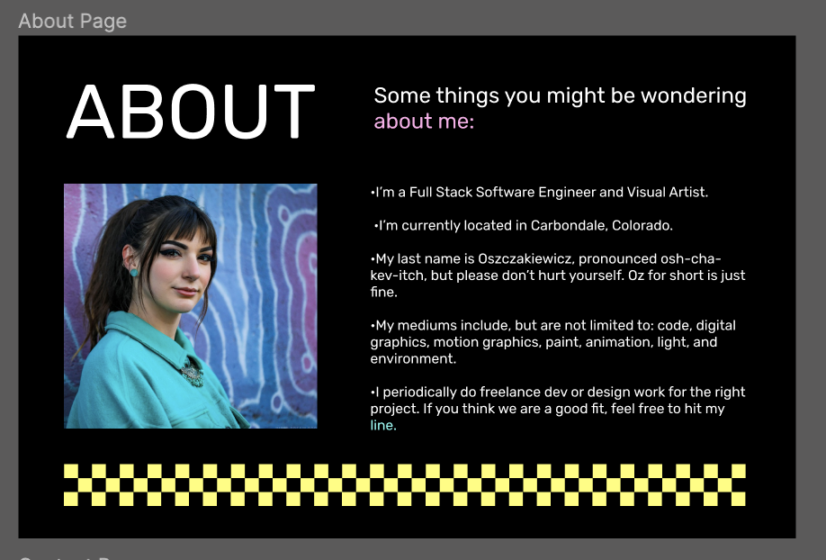
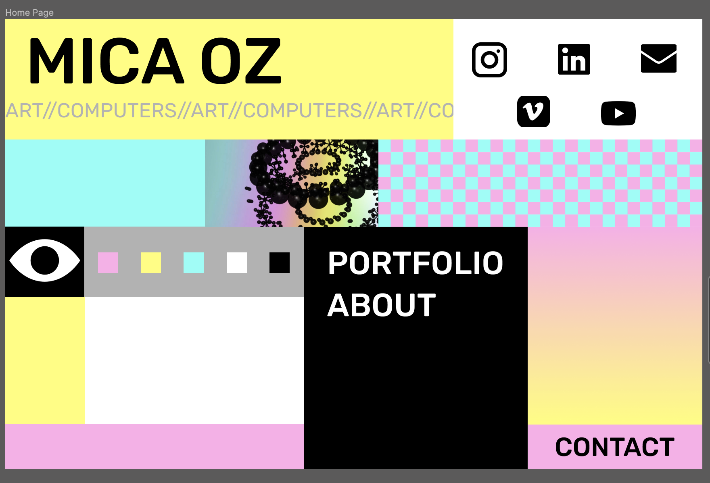

## Available Scripts

In the project directory, you can run:

### `npm start`

Runs the app in the development mode.\

HELLO WORLD:
Here is my portfolio site project which is currently under construction.

Here is the prototype in figma:
https://www.figma.com/file/1BlV03JNWTPLVtmUQhfZV2/Portfolio-Site?type=design&node-id=0-1&mode=design

Here are some images from the figma for convenience:

Right Now the current deployed version of this site can be found at:
https://micaoz-3e29397c429a.herokuapp.com/

Future State Features:

-Mobile responsivity

-Routing

-Home Page - UX:

    -Loading Page and load animations will be added

    -Block1 - will have hover functionality my name so that my full last name displays on hover

    -Block 2 - Icons will have a hover color change and animation

    -Block 3 - Will have custom frame by frame hover animations

    -Block 4 - Looper will be repositioned within the frame and increase responsivity

    -Block 5 - onlick will cause each checker to change color, making it possible for users to make their own color patterns. 1 check square will have an easter egg modal

    -Block6 - Iris in the eye will follow mouse movements over the page

    -Block7 - Color pallet for a mini 'paint' widget

    -Block 8 - Menu will have 2 portfolio options - visual art or SWE

    -Block 9 - looper of slowly changing gradient

    -Block10 - Will have custom frame by frame hover animations

    -Block 11 - Will be the canvas of a mini 'paint widget

    -Block 12 - Unsure if leaving blank, maybe add info of current proects?

    -Block 13 - Contact Page
